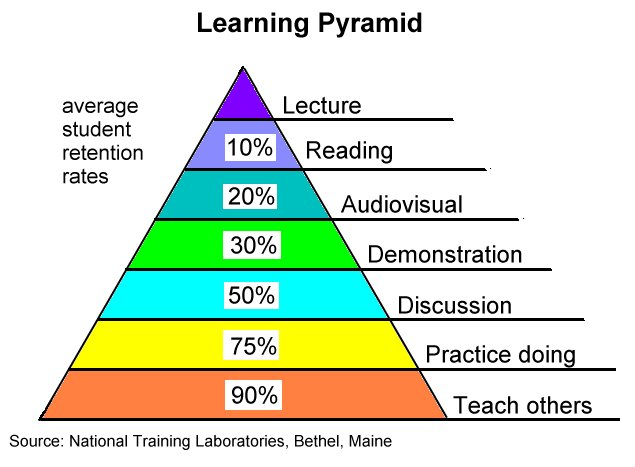

## Pratiques existantes

- TDD
- BDD
- Pratiques XP en general
- Mob Programming
- confectional method of debug =ruber duck
- Tests
- feature branch exploratoire (+refaire from scratch )
- automatisation + déclancheurs
- revues de code (bienveillantes)
- EventStorming
- (Refus injonction, recherche de sens)
- DDD 
- pratiquer des langages "inutiles"
- activités sociales hors production
- Exchange roles

## Bases de la discussion

- remarques sur le "Maitre": le maitre maitrise ses tech mais a du mal a voir ailleurs
- l'innovation vient d'ailleurs
- chercher avant tout les problemes à résoudre
- Innovation dans le travail de Didier: une grosse société lui présente un pb, il parts alors faire un poc chez lui hors contexte et permet de proposer une solution hors des schemas internes de pensée qui sont tj les mêmes.
- l'innovation peut justement venir de gens qui ne connaissent rien car ils posent des questions nouvelles naives.
- la maitrise c'est avant tout avoir du recul par rapport à l'experience
- savoir pratiquer des exercices de base pour pouvoir aller vers la maitrise

## Problemes

- avoir plus de feedback continu et indirect -> ne plus avoir d'hierarchie physique mais une hiérarchie d'importance de messages.
- milieu hostile: stagiaires, managers, hierarchie.

-> au final peu de pb soulevés autour de l'écriture du code en lui-meme mais plus au niveau de l'organisation.

## Notes

- quels sont les motivations de notre activité? 
- notre metier est-il un art? Il y a t il un lien entre l'activité de developpement et une activité artistique.

------

## Feedback loops !

## Learning Pyramid

-----

## Idees

- le principe du kata qui ne sert pas a de la prod peut s'utiliser pour le reste des activités
- developpement à résidence
- on fait beaucoup d'exercices sur sur du code mais les principaux pb ne sont pas sur du code mais sur l'humain donc on devrait faire des exercices dessus
- qqch groove grace à l'imperfection -> comment faire groover nos applications?

-----

## Links :

- livre Excercices in programming styles : https://www.amazon.fr/Exercises-Programming-Style-Cristina-Videira/dp/1482227371/ref=sr_1_fkmr2_1?ie=UTF8&qid=1489141486&sr=8-1-fkmr2&keywords=exercices+in+programming+style
- Luthier ukulele Oleron : http://www.la-case-a-ukes.com
- http://www.extremeprogramming.org/map/loops.html
- présentation de Chris Granger sur Eve : https://www.youtube.com/watch?v=5V1ynVyud4M
- essayer Eve: http://play.witheve.com
- the future of programming (le talk d'uncle bob qui refait l'histoire sur comment on en est arrivé là aujourd'hui): https://www.youtube.com/watch?v=ecIWPzGEbFc
- un article récent sur East Oriented programming: https://thesecretsquad.wordpress.com/2014/10/25/dazed-and-confuzzled/

